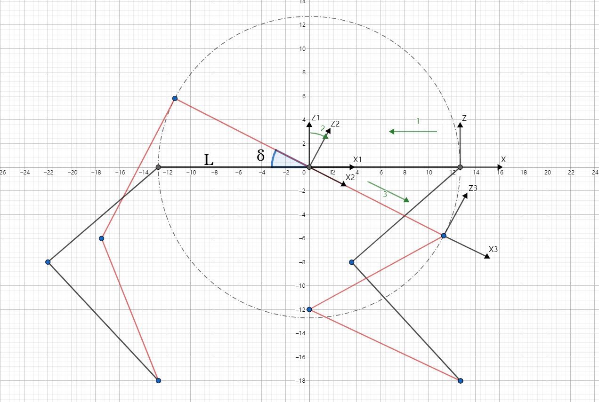
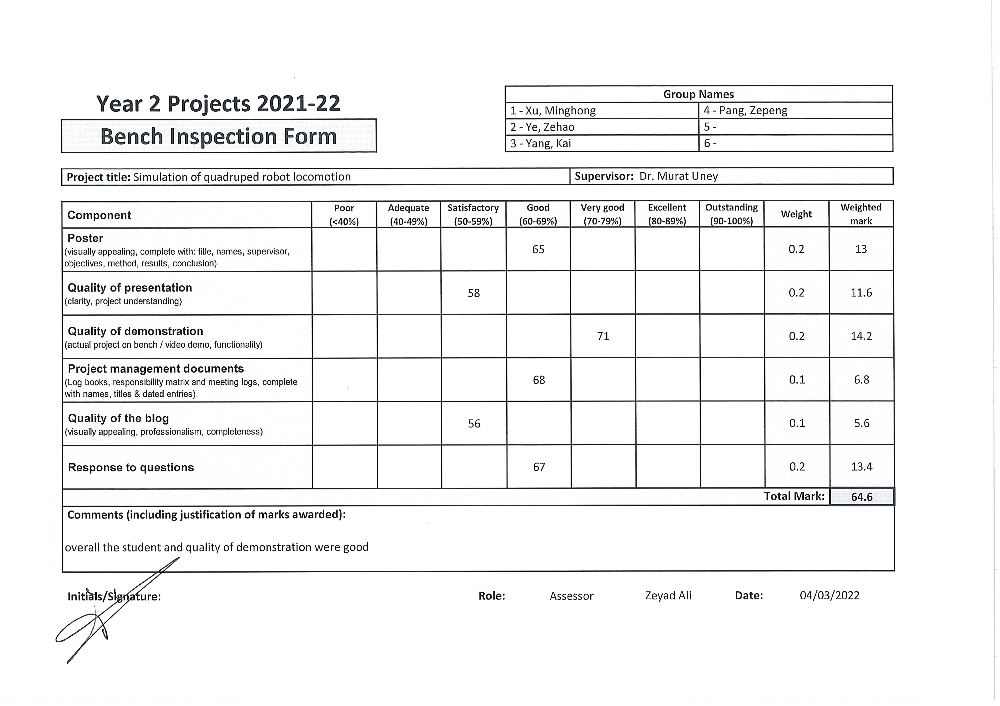
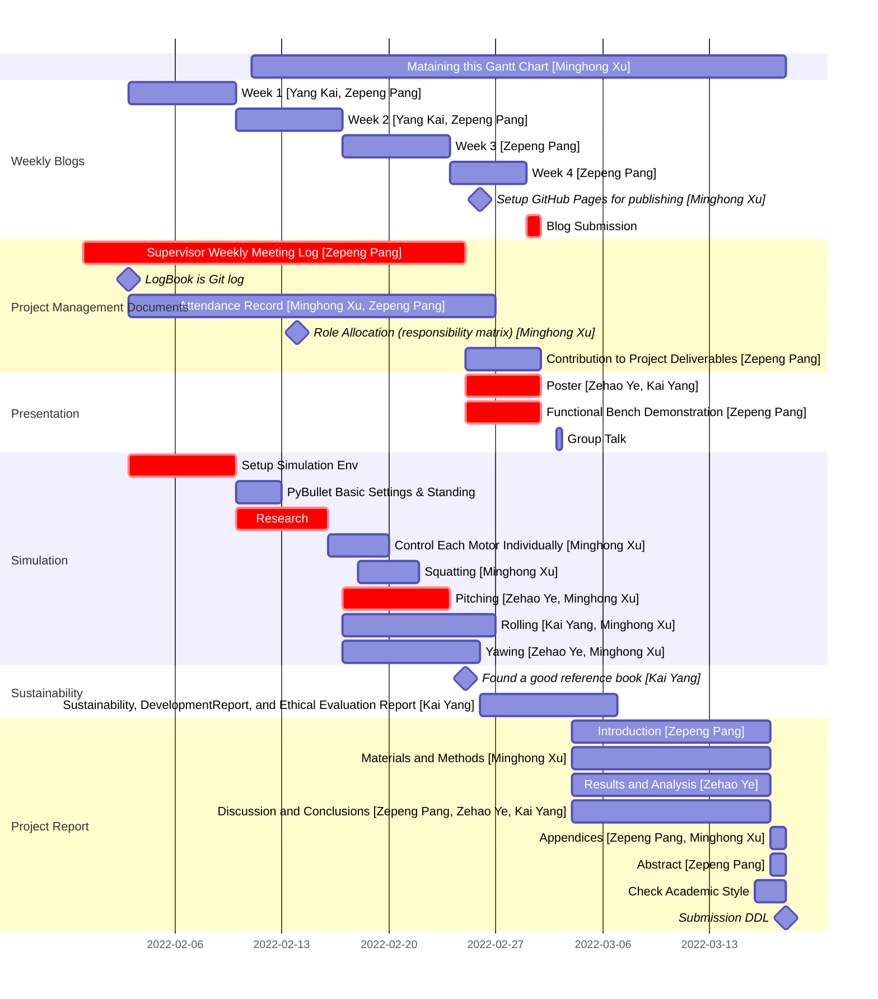

<h1 align="center">
  ELEC222-202122 Year 2 Project 
  Simulating postural control on a quadruped robot in PyBullet
</h1>

## Notations

$\alpha$: yaw angle
$\beta$: pitch angle
$\gamma$: roll angle
L: half the length of body
W: half the width of body

## Yawing

**Front Legs**

$$
\begin{flalign}
&
\begin{bmatrix}
   x_\text{after yawing} \\
   y_\text{after yawing} \\
   z_\text{after yawing} \\
   1                      \\
\end{bmatrix}
\=
\begin{bmatrix}
  \cos\beta & -\sin\beta & 0 & L \times \cos\beta ∓ W \times \sin\beta - L \\
  \sin\beta & \cos\beta & 0 & L \times \sin\beta ± W \times \cos\beta ∓ W  \\
  0 & 0 & 1 & 0 \\
  0 & 0 & 0 & 1 \\
\end{bmatrix}
\begin{bmatrix}
   x \\
   y \\
   z \\
   1 \\
\end{bmatrix}
&
\end{flalign}
$$

**Hind Legs**

$$
\begin{flalign}
&
\begin{bmatrix}
   x_\text{after yawing} \\
   y_\text{after yawing} \\
   z_\text{after yawing} \\
   1                      \\
\end{bmatrix}
\=
\begin{bmatrix}
  \cos\beta & -\sin\beta & 0 & -L \times \cos\beta ∓ W \times \sin\beta + L \\
  \sin\beta & \cos\beta & 0 & -L \times \sin\beta ± W \times \cos\beta ∓ W  \\
  0 & 0 & 1 & 0 \\
  0 & 0 & 0 & 1 \\
\end{bmatrix}
\begin{bmatrix}
   x \\
   y \\
   z \\
   1 \\
\end{bmatrix}
&
\end{flalign}
$$

## Pitching

**Front Legs**

$$
\begin{flalign}
&
\begin{bmatrix}
   \hat{x} \\
   \hat{z} \\
   1                       \\
\end{bmatrix}
\=
\begin{bmatrix}
  \cos\delta & -\sin\delta & L \times \cos\delta - L \\
  \sin\delta & \cos\delta & L \times \sin\delta \\
  0 & 0 & 1 \\
\end{bmatrix}
\begin{bmatrix}
   x \\
   z \\
   1 \\
\end{bmatrix}
&
\end{flalign}
$$

**Hind Legs**

$$
\begin{flalign}
&
\begin{bmatrix}
   x_\text{after pitching} \\
   z_\text{after pitching} \\
   1                       \\
\end{bmatrix}
\=
\begin{bmatrix}
  \cos\delta & -\sin\delta & -L \times \cos\delta + L \\
  \sin\delta & \cos\delta & -L \times \sin\delta \\
  0 & 0 & 1 \\
\end{bmatrix}
\begin{bmatrix}
   x \\
   z \\
   1 \\
\end{bmatrix}
&
\end{flalign}
$$

## Rolling

**Right Legs**

$$
\begin{flalign}
&
\begin{bmatrix}
   x_\text{after rolling} \\
   y_\text{after rolling} \\
   z_\text{after rolling} \\
   1                      \\
\end{bmatrix}
\=
\begin{bmatrix}
  1 & 0 & 0 & 0 \\
  0 & \cos\lambda & -\sin\lambda & W \times \cos\lambda - W \\
  0 & \sin\lambda & \cos\lambda & W \times \sin\lambda \\
  0 & 0 & 0 & 1 \\
\end{bmatrix}
\begin{bmatrix}
   x \\
   y \\
   z \\
   1 \\
\end{bmatrix}
&
\end{flalign}
$$

**Left Legs**

$$
\begin{flalign}
&
\begin{bmatrix}
   x_\text{after rolling} \\
   y_\text{after rolling} \\
   z_\text{after rolling} \\
   1                      \\
\end{bmatrix}
\=
\begin{bmatrix}
  1 & 0 & 0 & 0 \\
  0 & \cos\lambda & -\sin\lambda & -W \times \cos\lambda + W \\
  0 & \sin\lambda & \cos\lambda & -W \times \sin\lambda \\
  0 & 0 & 0 & 1 \\
\end{bmatrix}
\begin{bmatrix}
   x \\
   y \\
   z \\
   1 \\
\end{bmatrix}
&
\end{flalign}
$$

## Feedbacks

## Activity Diary

## Structure of the Repository

<pre>
📦year2-proj
 ┣ 📂.vscode
 ┣ 📂docs
 ┣ 📂feedback
 ┣ 📂hexo
 ┃ ┣ 📂themes/next
 ┃ ┃ ┗ 📜_config.yml
 ┃ ┗ 📜_config.yml
 ┣ 📂poster
 ┣ 📂proj_mgmt_forms
 ┣ 📂refs
 ┣ 📂report
 ┃ ┣ 📂preamble
 ┃ ┃ ┣ 📜packages.tex
 ┃ ┃ ┗ 📜top_matter.tex
 ┃ ┣ 📂front_matter
 ┃ ┣ 📂body
 ┃ ┣ 📂back_matter
 ┃ ┣ 📂figures
 ┃ ┣ 📜.latexmkrc
 ┃ ┣ 📜refs.bib
 ┃ ┣ 📜report.tex
 ┃ ┗ 📜snippets.tex
 ┣ 📂sde_report
 ┣ 📂simulation
 ┣ 📜.editorconfig
 ┣ 📜.gitattributes
 ┣ 📜.gitignore
 ┣ 📜LICENSE
 ┣ 📜poetry.lock
 ┣ 📜pyproject.toml
 ┗ 📜README.md
</pre>

Folder / File | Description
:---: | :---
📂docs | From where GitHub Pages site is built.
📂hexo | Hexo manages the project website here and publishes website to 📂docs.
📜.editorconfig | EditorConfig helps maintain consistent coding styles for multiple developers working on the same project across various editors and IDEs. The EditorConfig project consists of a file format for defining coding styles and a collection of text editor plugins that enable editors to read the file format and adhere to defined styles.
📂preamble | Where preliminary or preparatory statements are placed.
📜packages.tex | Where package-importing statements are placed.
📜top_matter.tex | Where metadata about a LaTeX document is placed.
📂simulation | Where simulation code is placed.
📜pyproject.toml | pyproject.toml contains build system requirements and [core metadata](https://packaging.python.org/en/latest/specifications/core-metadata/) of Python projects. *python-poetry* is a reference implementation for using pyproject.toml.
📜poetry.lock | This file prevents from automatically getting the latest versions of dependencies. Running `poetry install` when a poetry.lock file is present resolves and installs all dependencies that are listed in pyproject.toml, but Poetry uses the exact versions listed in poetry.lock to ensure that the package versions are consistent for everyone working on a project. To update to the latest versions, use the `poetry update` command. This will fetch the latest matching versions (as per pyproject.toml) and update the lock file with the new versions. (This is equivalent to deleting the poetry.lock file and running `poetry install` again.)
